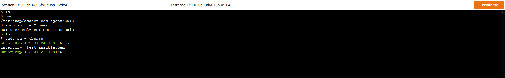
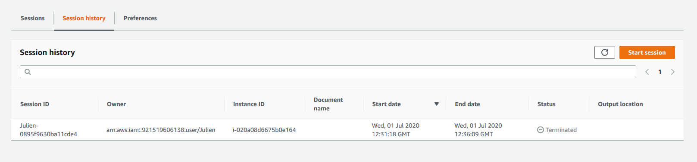

# AWS Certified Cloud Practitionner notes

AWS page for the certification is [here](https://aws.amazon.com/certification/certified-cloud-practitioner/)

## Exam Details

- multiple choice (1 correct response and 3 incorrect responses) and multiple answer (2 or more correct responses out of five or more options)
- The level is foundational, it's more an overview than a deep dive into a specific topic.
- Can be taken in accredited testing center or with an online proctored exam
- ⏱️ 90 minutes to complete the exam
- 💲 100 USD (20 USD for a practice exam)
- Available in English, Japanese, Korean and Simplified Chinese

## 📘 [Exam Guide](https://d1.awsstatic.com/training-and-certification/docs-cloud-practitioner/AWS-Certified-Cloud-Practitioner_Exam-Guide.pdf)

You can found the [exam guide here](https://d1.awsstatic.com/training-and-certification/docs-cloud-practitioner/AWS-Certified-Cloud-Practitioner_Exam-Guide.pdf).

### Goal

The certification is to validate that you have basic knowledge and skill of the AWS platform. It includes:

- Available services and their common use cases
- AWS Cloud architectural principles (at the conceptual level)
- Account security
- Compliance

There is also a part on AWS Cloud economics:

- cost
- billing
- value proposition of the AWS Cloud

### Prerequisite

Recommended to have 6 months of experience with the AWS Cloud in any role

Basic understanding of IT services and their uses in the AWS Cloud platform.

### Exam results

Pass or fail exam, minimum passing score is 700 (on a 100-1000 scale, so 70%)

### Content outline

| Domain                  | weight |
| ----------------------- | ------ |
| Cloud Concepts          | 26%    |
| Security and Compliance | 25%    |
| Technology              | 33%    |
| Billing and Pricing     | 16 %   |

## 📗 [Sample Exam Questions](https://d1.awsstatic.com/training-and-certification/docs-cloud-practitioner/AWS-Certified-Cloud-Practitioner_Sample-Questions.pdf)

You can find [sample exam questions here](https://d1.awsstatic.com/training-and-certification/docs-cloud-practitioner/AWS-Certified-Cloud-Practitioner_Sample-Questions.pdf)

## Resources to learn

### Free

Videos:

- 🎥 [AWS official course](https://aws.amazon.com/training/course-descriptions/cloud-practitioner-essentials/)
- 🎥 [freeCodeCamp.org YT video](https://www.youtube.com/watch?v=3hLmDS179YE)

Whitepapers:

- [Overview of Amazon Web Services](https://d0.awsstatic.com/whitepapers/aws-overview.pdf)
- [How AWS Pricing Works](http://d1.awsstatic.com/whitepapers/aws_pricing_overview.pdf)
- [Compare AWS Support Plans](https://aws.amazon.com/premiumsupport/plans/)

## Notes

### Cloud Concepts

#### What is cloud computing?

Cloud computing: using a network of remote servers hosted on the Internet to store/access/manage/processo data, rather than a local server or personal computer

| On-premise                      | Cloud Providers                                                                                      |
| ------------------------------- | ---------------------------------------------------------------------------------------------------- |
| You own the server              | Someone else owns the server                                                                         |
| You hire IT people              | Someone eslse hires IT people                                                                        |
| You pay or rent the real-estate | Someone else payes or rents the real-estate                                                          |
| You take all the risk           | You are responsible for configuring your cloud services and code, someone else take care of the rest |

#### Why go with a cloud provider over on-premise?

- _Trade capital expense for variable expense_ **No upfront-cost** **Pay On-Demand**
- _Benefit from massive economies of scale_
- _Stop guessing capacity_ No need to guess the sizing of the infrastructure.
- _Increase speed and agility_ Lauch resources within minutes
- _Stop spending money on running and maintaining data centers_
- _Go global in minutes_ Deploy in multiples regions around the world with a few clicks

#### Types of Cloud Computing

- _SaaS_ **For Customers** A completed product that is run and managed by the the service provider.
  Don't worry about how the service is maintained. It just works and remain available.
- _PaaS_ **For Developers** Removes the need for your organisation to manage the underlying infrastructure. Focus on the deployment and management of your applications.
  Don't worry about provisioning, configuring or understanding the hardware or OS.
- _IaaS_ **For Admins** The basic building blocks for cloud IT. Provides access to networking features, computers and data storage space.
  Don't worry about IT staff, data centers and hardware.
  **AWS is here**

#### Cloud Computing Deployment Models

- _Cloud_ Fully utilizing cloud computing
  This includes _startups_, _SaaS offerings_ and _new projects and companies_
- _Hybrid_ Using both Cloud and On-Premise
  This includes _Banks_, _Fintech_, _Large Professional Service Providers_, _Legacy on-premise_
- _On-Premise_ Deploying resources on-premises, using virtualization and resource management tools, is sometimes called 'private cloud'
  This includes _public sector_, _sensitive data (hospital)_, _Large entreprise with heavy regulation (insurance companies)_

### AWS Global Infrastructure

69 Availability Zones (AZ) within 22 Geographic Regions around the world. Way more Edge Locations than AZ!

_Regions_ are physical location in the world with multiple Availibity Zones

_Availability Zones_ are one or more discrete data centers

_Edge Locations_ are datacenter owned by a trusted partner of AWS

#### [Regions](https://aws.amazon.com/about-aws/global-infrastructure/regions_az/)

A geographically distinct location which has mutliple datacenters (AZs).

Every region is _physically isolated_ from and independent of every other region in terms of location, power, water supply.

Each region has at least 2 AZs.

AWS largest region is _US-EAST_.

New services almost always launch first in _US-EAST_.

Not all services are available in all regions. You can see on the [regional table](https://aws.amazon.com/about-aws/global-infrastructure/regional-product-services/?p=ngi&loc=4) what services are available in each region.

_US-EAST-1_ is the region where you see all your billing information.

#### [Availability Zones](https://aws.amazon.com/about-aws/global-infrastructure/regions_az/?p=ngi&loc=2)

A datacenter owned and operated by AWS in which AWS services run.

Each region has at least two AZs (most region have 3 or more)

AZ are represented by a Region Code, followed by a letter identifier eg. us-east-1a

**Multi-AZ** Distributing your instances across multiple AZs allows failover configuration for handling requests when one goes down.

<10ms latency between AZs of a same region
<100km between AZs of a same region

#### [Edge Locations](https://aws.amazon.com/about-aws/global-infrastructure/regions_az/?p=ngi&loc=2)

Get data fast or upload data fast to AWS.

An Edge Location is a datacenter owned by a trusted partner of AWS which has a **direct connection** to the AWS network.

These locations serve requests for **CloudFront** and **Route 53**. Requests going to either of these services will be routed to the nearest edge location automatically.

**S3 Transfer Acceleration** traffic and **API Gateway** endpoint traffic alsu use the AWS Egde Network.

This allow for _low latency_ no matter where the end user is geographically located.

#### [GovCloud Regions](https://aws.amazon.com/govcloud-us/)

AWS GovCloud Regions allow customers to host sensitive **Controlled Unclassified Information** and other types of regulated workloads.

GovCloud Region are only operated by employees who are U.S. citizen, on U.S. soil.

They are only accessible to U.S. entities and root account holders who pass a screening process.

Customers can architect secure cloud solutions that comply with:

- FedRAMP High Baseline
- DOJ's Criminal Justice Information Systems (CJIS) Security Policy
- U.S. International Traffic in Arms Regulations (ITAR)
- Export Administration REgulatioins (EAR)
- Deparment of Defense (DoD) Cloud Computing Security Requirement Guide

### Hands on lab

#### IAM

Where you create user/group and policies for password, what kind of endpoint you activate/disable etc

MFA can(should) be activated [here](https://console.aws.amazon.com/iam/home#/security_credentials)

_You should not use the root password for your everyday usage of AWS_. Create an user with admin capability and use this one.

#### Session Manager

Instead of using SSH we can use Session Manager to access services.
For EC2 for example, it means you don't need to have SSH ports open on the instances you lauch. It also mean that administrators can give access to the session manager to some user, and even choose which instance inside of the session manager they are allowed to use.

Session manager integrate with _CloudTrail_, _S3_, _CloudWatch Logs_, _CloudWatch Events_ and _Amazon SNS_ to log and audit session activity.

You can see above that you are logged as root by default, so you have to use `sudo su - ubuntu` to use the user `ubuntu` (was the default user in my case)

The strength of it is that by using sessions, you can log and audit who is logging in and out of the system.

#### Amazon Machine Image (AMI)

An AMI is like a blueprint for an instance. When creating the AMI, you configure it (EBS snapshots, OS, application server, permissions, volumes to attach to it etc)

We can create an AMI for an already existing EC2 instance.

You need an AMI to use Auto Scaling Groups

#### Auto Scaling Groups

Allow to scale servers with a set of rules. Good to ensure at least a mininum number of machine are up, or when you need to grow capacity.

#### Elastic Launch Balancer ELB

Distribute traffic between multiple instance. The goal is to have instances in multiple AZs, in case one has a failure, the other one will get the traffic from the load balancer and the application/users will not be impacted.

#### Simple Storage Service S3

Store any data, lots of type of storage depending on the access pattern

#### CloudFront

CDN service, can be used in conjunction with S3 (and other services) to deliver content to users with good performance.

### Trivia (don't know how to title this)

#### Pricing Model - EC2

- **On-Demand**
  Flexible, pay by the hour
  Can be good for short-term unpredictable workload
  Small apps / first time apps
- **Spot** (upto 90% saving)
  Needs a task that is flexible with the start/end time, and can handle interruptions
  Used for non-critical background jobs
  AWS Batch is an easy way to use Spot pricing

  **Termination condition**

  - instances can be terminated by AWS _at any time_
  - if you instance is terminated by AWS, _you don't get charged_ for a partial hour of usage
  - if _you terminate_ an instance, _you will be charged_ for any hour that it ran

- **Reserved** (upto 75% off)
  Steady/predictable usage
  Commit to EC2 over a 1 or 3 year term
  Can resell unused reserved instances
  Can pay _upfront_, _partial upfront_ or _no upfront_. The greater the upfront the better the saving.
  Either

  - _Standard_ (up to 75% saving) you cannot change RI attributes
  - _Convertible_ (up to 54% saving). Allows to change RI attributes if greater or equal in value.
  - _Scheduled_ (variable savings). You reserve instances for specific time periods

  RI can be shared between mutliple accounts within an org.
  Unused RI can be sold in the _Reserved Instance Marketplace_

- **Dedicated** (expensive)
  Dedicated servers
  Can be on-demand or reserved
  When you need a guarantee of isolated hardware (because of regulation or server-bound licensing)

#### Free services

- IAM - Identity Access Management
- [Amazon VPC](https://aws.amazon.com/vpc/) - Virtual Private Cloud
- [Organisations & consolidated Billing](https://docs.aws.amazon.com/awsaccountbilling/latest/aboutv2/consolidated-billing.html)
- [Cost Explorer](https://docs.aws.amazon.com/awsaccountbilling/latest/aboutv2/ce-what-is.html)

Certain services are free themselves, but the resources they setup will cost you.

- [Auto Scaling](https://aws.amazon.com/autoscaling/)
- [CloudFormation](https://aws.amazon.com/cloudformation/) - Model and provision cloud infrastructure resources
- [Elastic Beanstalk](https://aws.amazon.com/elasticbeanstalk/) - deploy/scale web app and services
- [Opsworks](https://aws.amazon.com/opsworks/) - automate operations with Chef and Puppet
- [Amplify](https://aws.amazon.com/amplify/) - build mobile and web app, part of the amplify framework
- [AppSync](https://aws.amazon.com/appsync/) - Power application with the right data, from one or more data sources (managed GraphQL)
- [CodeStar](https://aws.amazon.com/codestar/) - develop, build and deploy app. Unified UI to set up CD pipeline

#### [Support Plan](https://aws.amazon.com/premiumsupport/plans/)

- _Basic_
  Email support only
  For _billing and account_
  7 trusted advisor [checks](https://aws.amazon.com/premiumsupport/technology/trusted-advisor/best-practice-checklist/)
  \$0/month
- _Developer_
  tech support via email ~24h until reply
  No third party support
  General Guidance <24h
  System impaired <12h
  7 trusted advisor [checks](https://aws.amazon.com/premiumsupport/technology/trusted-advisor/best-practice-checklist/)
  \$20/month
- _Business_
  Tech support via email ~24h until reply
  Tech support via Chat, Phone 24/7
  General Guidance <24h
  System impaired <12h
  Production System Impaired <4h
  Production System Down <1h
  All trusted advisor [checks](https://aws.amazon.com/premiumsupport/technology/trusted-advisor/best-practice-checklist/)
  \$100/month
- _Enterprise_
  Tech support via email ~24h until reply
  Tech support via Chat, Phone 24/7
  General Guidance <24h
  System impaired <12h
  Production System Impaired <4h
  Production System Down <1h
  Business-Critical System Down <15min
  Personal Concierge
  TAM - Designated Technical Account Manager to proactively monitor your environment and assist with optimization
  All trusted advisor [checks](https://aws.amazon.com/premiumsupport/technology/trusted-advisor/best-practice-checklist/)
  \$15000/month

#### AWS Marketplace

Curated digital catalogue of software listings from independent software vendors.

Easily find, buy, test, and deploy software that already runs on AWS.

The product can be _free_ to use or have an _associated charge_.

Products can be offered as:

- AMI - Amazon Machine Image
- AWS CloudFormation templates
- Software as a service (SaaS) offerings
- [Web ACL](https://docs.aws.amazon.com/waf/latest/developerguide/web-acl.html) - Access Control List
- AWS WAF rules

The sales channel for ISVs and Consulting Partners allows you to sell your solutions to other AWS customers

#### AWS Trusted Advisor

Advises you on security, saving money, performance, service limits and fault tolerance.
Automated checklist of best practices on AWS

7 free checks that might be useful are:

- Idle Load Balancers (Cost optimization) - tells you if you have a load balancer that you pay and don't use
- Unassociated Elastic IP Adresses (Cost optimization) - tells you if you have an IP adresses not used by any instances (because it costs money to reserve one)
- High Utilization EC2 instances (Performance) - recommend a higher tier EC2 instance to get better performance
- MFA on Root Account (Security) - very important!
- IAM Access Key Rotation (Security) - very important too
- Amazon RDS Backups (Fault Tolerance) - Make sure you have backup on, to restore a database if needed
- VPC (service limits) - to ask for a service limit increase

Also SNS limit (service limits) - ask a limit increase for the mails processed

You can turn on weekly notification about what's good and what need to be done from AWS trusted advisor

#### [Consolidated Billing]https://docs.aws.amazon.com/awsaccountbilling/latest/aboutv2/consolidated-billing.html

One bill for all of your account (turned on by defaut for organisation account)

Consolidate your billing and pyament nethods across multiple AWS accounts into one bill.

For billing AWS treats all the accounts in an organization as if they were one account.

You can designate one master account that pays the charges of all the other member accounts.

Consolidated billing is offered at no additional cost!

You cans use _Cost Explorer_ to visualize usage for consolidated billing

#### [Consolidated Billing Volume Discounts](https://docs.aws.amazon.com/awsaccountbilling/latest/aboutv2/useconsolidatedbilling-discounts.html)

AWS has **volume discount** for many services.

Consolidated Billing can let you take advantage of volume discounts.

#### [Cost Explorer](https://aws.amazon.com/aws-cost-management/aws-cost-explorer/)

Lets you visualize, understand, and manage your AWS costs and usage over time.

Default reports help you gain insight into your AWS usage and cost.
You can also generate forecast based on your past and current usage.

You can filter and group the data to get even more deep insights into what's going on.

You can save/export reports.

#### [AWS Budgets](https://aws.amazon.com/aws-cost-management/aws-budgets/)

Plan you service usage, service costs and Instance reservations.

A billing alarm on steroids

First two budgets are free, then 0.02$/day (~0.60$/month). Limit of 20 000 bugdets.

- Can be tracked at the _monthly_, _quarterly_ or _yearly_ level
- Create _cost_, _usage_ or _reservation_ budgets
  - Alert support for _EC2_, _RDS_, _Redshift_ and _ElastiCache_ reservations
- Can be managed from the AWS Budgets dashboard or via the Budgets API
- Get notified by providing an email or chatbot

#### [Total Cost of Ownership (TCO) calculator](https://aws.amazon.com/tco-calculator/)

Estimate how much you would save when moving to AWS from on-premise.

Provides you _a detailed set of reports_ that _can be used in executive presentations_.

The tool is build on underlying calculation models that generate fair assessments of value that you can achieve given the data provided.

The tool is for **approximation purposes** only!

#### [AWS Landing Zone](https://aws.amazon.com/solutions/implementations/aws-landing-zone/)

Helps _Enterprises_ quickly set-up a secure, AWS multi-account

Provides you with a baseline environment to get started with a **multi-account architecture**

**AWS Account Vending Machine AVM** automatically provisions and configure new accounts via a Service Catalog Template.
Uses a Single Sign-on (SSO) for managing and accessing accounts.

The environment is customizable to allow customers to implement their own account baselines through a Landing Zone configuration and update pipeline.

#### [Resources Groups and Tagging](https://docs.aws.amazon.com/ARG/latest/userguide/welcome.html)

**Tags** are word or phrases that act as metadata for organizing your AWS resources.
**Resource Groups** are a collection of resources that share one or more **tags**.

Resource Groups can display details about a group of resource based on

- metrics
- alarms
- configuration settings

At any time you can modify the settings of your resource groups to change what resources appear.

#### [AWS QuickStart](https://aws.amazon.com/quickstart/)

Prebuilt templates by AWS and AWS Partners to help you deploy popular stacks on AWS.

Reduce hundreds of manual procedures into just a few steps

3 parts:

- A reference architecture for the deployment **Very good to look a those to get an idea how to architecture on AWS**
- AWS CloudFormation template that automate and configure the deployment
- A deployment guide explaining the architecture and implementation in detail

Most Quick Start reference deployments enable you to spin up a fully functional architecture in less than an hour!

#### [AWS Cost and Usage Report](https://aws.amazon.com/aws-cost-management/aws-cost-and-usage-reporting/)

Big spreadsheet of your cost and usage.

Place the reports into an **S3**

Can use **Athena** to transform the report into a queryable database

Use **QuickSight** to visualize your billing data as graphs

#### [AWS Organizations and accounts](https://aws.amazon.com/organizations/)

When you first create an account with AWS, your account is the **Root user**. It's single sign-in identity that has complete access to all AWS services and resources in an account. Each account has a Root Account User.

You can promote your root account to become an **Organizations**, allowing you to centrally manage billing, control access, compliance, security and share resources across your AWS accounts.

**Organization Units** are a group of AWS accounts within an organization which can also contain other organizational units - creating hierarchy.

**Service Control Policies** give central control over the allowed permissions for all accounts in your organization, helping to ensure your accounts stay within your organization's guidelines.

### Technology overview

#### [AWS Networking](https://aws.amazon.com/solutionspace/networking/)

- **Region** the geographical location of your network
- **AZ** the data center of your AWS resources
- **VPC** a logically isolated section of the AWS Cloud where you can launch AWS resources
- **Internet Gateway** Enable access to the Internet
- **Route Tables** determine where network traffic from your subnets are directed
- **NACLs** acts as a firewalls at the subnet level
- **Security Groups** acts as a firewall at the instance level
- **Subnets** A logical partition of an IP network into multiple, smaller networks segments

#### [Database services](https://aws.amazon.com/products/databases/)

- **DynamoDB** NoSQL _key/value_ database (think Cassandra)
- **DocumentDB** NoSQL _document_ database that is MongoDB compatible
- **RDS** - _Relational_ Database Service that supports multiple engines
  - Engines: MySQL, Postgres, MariaDB, Oracle, Microsoft SQL Server, Aurora
  - Aurora MySQL (5x faster) and PSQL (3x faster) database _fully managed_
  - Aurora serverless - only runs when you need it, like AWS lambda
- **Neptune** - Managed _graph_ database
- **Redshift** - _Columnar_ database, _petabyte_ warehouse
- **ElastiCache** - _Redis_ or _MemCached_ database

#### Provisioning Services

The allocation or creation of resources and services to a customer

- **Elastic Beanstalk** - service for deploying and scaling web applications and services developed with Java, .Net, PHP, Node.js, Python, Ruby, Go, and Docker. (like Heroku)
- **OpsWorks** - configuration management service that provides managed instances of _Chef_ and _Puppet_
- **CloudFormation** - infrastructure as code, JSON or YAML
- **AWS QuickStart** - pre-made packages that can launch and configure your AWS compute, network, storage, and other services required to deploy a workload on AWS.
- **AWS Marketplace** - digital calalogue of _thousands_ of software listings from independent software vendors you can find, test, buy and deploy

#### Computing Services

- **EC2 - Elastic Compute Cloud**, highly configurable server eg. CPU, Memory, Network, OS.
  _every computing services run on EC2 under the hood_
- **ECS - Elastic Container Service** _Docker as a Service_, highly scalable, high performance container orchestration service that supports Docker containers, pay for EC2 instances
- [**Fargate**](https://aws.amazon.com/fargate/) Microservices where you don't think about the infrastructure. Pay per task.
- **EKS** _Kubernetes as a Service_ easy to deploy, manage and scale containerized applications using Kubernetes
- **Lambda** _serverless functions_ run code without provisioning or managing servers. You pay onlyl for the compute time you consume.
- **Elastic Beanstalk** orchestrate various AWS services, including EC2, S3, Simple Notification Service (SNS), CloudWatch, autoscaling, and Elastic Load Balancers
  _more for dev environment than for prod_
- **AWS Batch** plans, schedules and executes your batch computing workloads across the full range of AWS compute services and features, such as _EC2_ and _Spot instances_

#### Storage

- **S3 - Simple Storage Service** - _object_ storage
- **S3 Glacier** low cost storage for _archiving and long-term backup_
- **Storage Gateway** - Hybrid cloud storage with local caching
  - File Gateway
  - Volume Gateway
  - Tape Gateway
- **EBS - Elastic Block Storage** - hard drive in the cloud you attach to EC2 instances
  - SSD, IOPS SSD, Throughput HHD, Cold HHD
- **EFS - Elastic File Storage** - file storage mountable to multiple EC2 instances at the same time
- **Snowball** - physically migrate lots of data via a computer suitcase 50-80TB
  - **Snowball Edge** A better version of Snowball - 100TB
  - **Snowmobile** Shipping container, pulled by a semi-trailer truck- 100 PB

#### Business Centric Services

- **Amazon Connect** - _Call Center_ - Cloud-based call center service you can setup in just a few clicks - based on the same proven system used by the Amazon customer service teams.
- **WorkSpaces** - _Virtual Remote Desktop_ - Secure managed service for provisioning either Windows or Linux desktops in just a few minutes which quickly scales up to thousands of desktops
- **WorkDocks** - A content creation and collaboration service -easily create, edit, and share content saved centrally in AWS. (_AWS version of Sharepoint_)
- **Chime** - AWS Plarform for _online meeting, video conferencing_, and business calling which elastically scales to meet your capacity needs.
- **WorkMail** - Managed _business email_, contacts, and calendar service with support for existing desktop and mobile email client applications. (IMAP)
- **Pinpoint** - Marketing campaign management system you can _use for sending targeted email_, SMS, push notifications, and voice messages
- **SES - Simple Email Service** - A cloud-based email sending service designed for marketers and applications developers to _send marketing, notification, and emails_
- **QuickSight** - A business intelligence (BI) service. Connect multiple datasource and quickly visualize data in the form of graphs with little to no programming knowledge

#### Enterprise Integration

Going Hybrid!

- [**Direct Connect**](https://aws.amazon.com/directconnect/?nc=sn&loc=0) dedicated Gigabit network connection from your premises to AWS.
  Imagine having a direct fibre optic cable running straight to AWS
- **VPN** establish a _secure_ connection to your AWS network
  - Site-to-Site VPN: connection your on-premise to your AWS network
  - Client VPN: connection a client (laptop/desktop) to your AWS network
- **Storage Gateway** A hybrid storage service that enables your on-premises applications to use AWS cloud storage. You can use this for backup and archiving, disaster recovery, cloud data processing, storage tiering and migration.
- **Active Directory** The AWS Directory Service for Microsoft Active Directory aslso known as AWS Managed Microsoft AD - enables your directory-aware workloads and AWS resources to use managed Active Directory in the AWS Cloud

#### Logging Services

- **CloudTrail** - logs *API calls (SDK, CLI) between *AWS services\* (who can we blame)
  Who created this bucket, who spun up that expensibe EC2 instance, who launched this SageMaker Notebook?

  - Detect developer misconfiguration
  - Detect malicious actors
  - Automate responses

- **CloudWatch** - is a collection of multiple services
  - CloudWatch **Logs** - Performance data about AWS services eg. CPU Utilization, Memory, Network in application logs, Lambda logs
  - CloudWatch **Metrics** - Represents a time-ordered set of data points. A variable to monitor
  - CloudWatch **Events** - trigger an event based on a condition eg. every hour take a snapshot of server
  - CloudWatch **Alarms** - trigger notifications based on metrics
  - CloudWatch **DashBoard** - create visuazations based on metrics

#### Know your initialisms

- _IAM_ Identity and Access Management
- _S3_ Simple Storage Service
- [_SWF_](https://aws.amazon.com/swf/) Simple Workflow Service
- _SNS_ Simple Notification Service
- _SQS_ Simple Queue Service
- _SES_ Simple Email Service
- _SSM_ Simple System Manager
- _RDS_ Relational Database Service
- _VPC_ Virtual Private Cloud
- _VPN_ Virtual Private Network
- _CFN_ CloudFormation
- _WAF_ Web Application Firewall
- _MQ_ Amazon ActiveMQ
- _ASG_ Auto Scaling Groups
- _TAM_ Technical Account Manager
- _ELB_ Elastic Load Balancer
- _ALB_ Application Load Balancer
- _NLB_ Network Load Balancer
- _EC2_ Elastic Cloud Compute
- _ECS_ Elastic Container Service
- _ECR_ Elastic Container Repository
- _EBS_ Elastic Block Storage
- _EFS_ Elastic File Storage
- _EMR_ Elastic MapReduce
- _EB_ Elastic Beanstalk
- _ES_ Elasticsearch
- _EKS_ Elastic Kubernetes Service
- _MKS_ Managed Kafka Service
- _IoT_ Internet of Things
- _RI_ Reserved Instances

### Security

#### [Shared Responsibility Model](https://aws.amazon.com/compliance/shared-responsibility-model/)

Having the right idea about what you are in charge of configuring/protecting, and what is AWS's responsability.

Basically, AWS is responsible for the infrastructure (how to setup the regions, AZs, Edge locations, datacenter, hardware) and also to tune/maintain the software for the compute, storage, database and networking.

You are in charge:

- server-side encryption (file system and/or data)
- client-side data encryption & data integrity, authentication
- networking traffic protection (encryption, integrity, identity)
- operating system, network and firewall configuration
- platform, applications identity & access management
- customer data

_Another way of putting it_:

Customer is responsible for security **IN** the cloud. (data, configuration)
AWS is responsible for security **OF** the cloud. (hardware, operation of managed services, global infrastructure)

#### [AWS Compliance Programs](https://aws.amazon.com/compliance/programs/)

A set of internal policies and procedures of a company to comply with laws, rules and regulations or to uphold business reputation.

Two important:

- _HIPAA_ Health Insurance Portability and Accountability Act - in the US, to work with medical information
- _PCI DSS_ Payment Card Industry Data Security Standard - When you want to sell things online and you need to handle credit card information

Full list: https://aws.amazon.com/compliance/programs/

#### AWS Artifact

_How do we prove AWS meets a compliance?_

No cost, serlf-service portal for on-demand access to AWS compliance reports.

#### Amazon Inspector

_How do we prove an EC2 Instance is harden?_

Hardening is the act of eliminating as many **security** risks as possible.

AWS Inspector runs a **security benchmark** against specific EC2 instances.
You can run a variety of security benchmarks.

Can perform both **Network** and **Host** assessments.

1. install the AWS agent on your EC2 instances
2. run an assessment for you assessment target
3. review your findings and remediate security issues

One very popular benchmark you can run is by CIS which as _699 checks_

#### AWS WAF

AWS Web Application Firewall protect your web applications from common web exploits.
Write your own rules to ALLOW or DENY traffic based on the contents of an HTTP requests.
Use a ruleset from a trusted AWS Security Partner in the AWS WAF Rules Marketplace
WAF can be attached to either **CloudFront** or an **Application Load Balancer**

Protect web applications from attacks covered in the OWASP Top 10 most dangerous attacks:

1. Injection
2. Broken Authentication
3. Sensitive data exposure
4. XML External Entities (XXE)
5. Broken Access Control
6. Security misconfigurations
7. Cross Site Scripting (XSS)
8. Insecure Deserialization
9. Using Components with known vulnerabilities
10. Insufficient logging and monitoring
